# Fresh Cooked Tweens
A tweening library for Unreal Engine, by [Jared Cook](https://twitter.com/FreshCookedDev)

### C++:

```c++
FCTween::Play(
    GetActorLocation(),
    GetActorLocation() + FVector(0, 0, 50),
    [&](FVector t)
    {
        SetActorLocation(t);
    },
    2.0f,
    EFCEase::OutCubic);
```

### Blueprints:
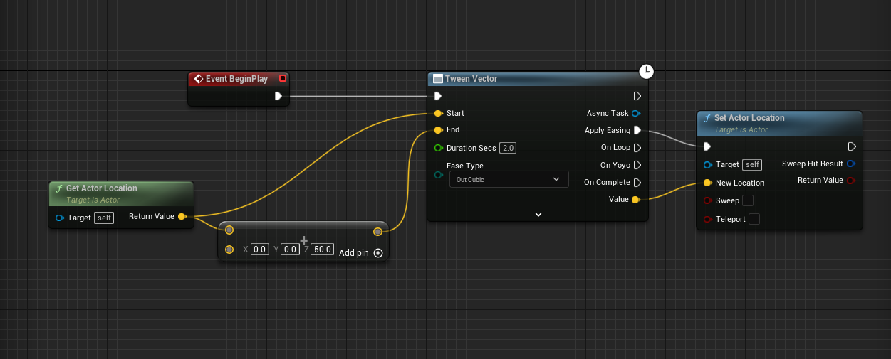

<details>
<summary>Why Tweens? (Expand)</summary>

Tweening libraries provide convenient curve equations to ease a value be***tween*** a start and end, like a position, scale, rotation, alpha, color, or anything else you might want to smoothly change. They are useful in small projects and large projects. Many polished UIs have some kind of tween operating.

It can be a large efficiency gain to let a programmer or designer quickly set up a tween with easily tunable values, instead of taking up the art department's precious time tweaking curves manually. I've often set up a tween with some ballpark values, and then passed it over to an artist to tweak, and they often appreciate how much time they save getting those polish animations in.

In big projects, they are great for those little polish items. Some small projects can find broader use for them:


```c++
WaddleRotator = GetMesh()->GetRelativeRotation();
WaddleTween = FCTween::Play(
    -WADDLE_ANGLE, WADDLE_ANGLE,
    [&](float t)
    {
        WaddleRotator.Pitch = t;
        GetMesh()->SetRelativeRotation(WaddleRotator);
    },
    WADDLE_SECS, EFCEase::InOutSine)
                  ->SetYoyo(true)
                  ->SetLoops(-1);
```

</details>

<details>
<summary>Functionality already in Unreal Engine (Expand)</summary>

It's good to know what is already available to you in-engine before installing other tools. Unreal provides [Timelines](https://docs.unrealengine.com/4.27/en-US/ProgrammingAndScripting/Blueprints/UserGuide/Timelines/) which can be very useful. They're not as convenient and quick to set up or tweak as tweens usually are, though. Time is money!

And for easings, Unreal has a lot of functionality already - Epic provides ease in/out/inout for sin, expo, circular, smoothstep - `FMath::InterpEaseIn()` lets you define your own exponent, which lets you do quad, cubic, quart, or more. So if all you need is those easing equations or Timelines, Epic has already got you covered.

Something Unreal provides that this library doesn't is [critically damped springs](https://www.alexisbacot.com/blog/the-art-of-damping), which is useful for a lot of things, especially cameras. Check out these functions if you haven't heard of that yet:
```c++
FMath::SpringDamper()
FMath::CriticallyDampedSmoothing()
UKismetMathLibrary::FloatSpringInterp()
UKismetMathLibrary::QuaternionSpringInterp()
```

What FCTween does provide is a more convenient, design-oriented way to define a tween, and some other useful ease equations (bounce, back, elastic, stepped). I wrote this library because I felt the in-engine functionality was a little too awkward to be useful for tweening purposes (especially in code). [BenUI](https://benui.ca/unreal/uitween/) has a great tweening library, but it's specifically for UI properties, and I wanted something more general and with blueprint nodes included.


</details>

# Easing Functions
<details>
<summary>Expand</summary>

Useful quick reference: https://easings.net/

| Available  | Functions  |              |     |
|------------|------------|--------------|-----|
| Linear     | InCubic    | InExpo       | InBounce    |
| Smoothstep | OutCubic   | OutExpo      | OutBounce   |
| Stepped    | InOutCubic | InOutExpo    | InOutBounce |
| InSine     | InQuart    | InCirc       | InBack      |
| OutSine    | OutQuart   | OutCirc      | OutBack     |
| InOutSine  | InOutQuart | InOutCirc    | InOutBack   |
| InQuad     | InQuint    | InElastic    |             |
| OutQuad    | OutQuint   | OutElastic   |             |
| InOutQuad  | InOutQuint | InOutElastic |             |

## In/Out explanation
Most functions have an In, Out, and InOut version. This indicates which end of the function the easing takes place.

"In" means the easing happens at the start:

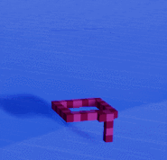

"Out" means the easing happens at the end:


"InOut" means the easing happens at start and end:

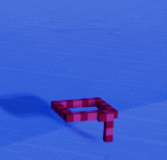

## Examples 

Linear
- It's just a lerp

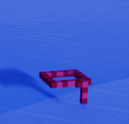

Sine
- Quad is usually preferred, since this one uses a Sine operation and is more expensive. But it's more gradual than Quad is, so it can be useful in places where you need the smoothest ease possible.


Quadratic
- The bread and butter - cheap formula (t * t) and looks good


Cubic
- A more drastic Quadratic (t * t * t)


Quartic
- Even more drastic (t * t * t * t)


Quintic
- Veeeery drastic (t * t * t * t * t)


Exponential
- Like Quintic but even sharper


Circular
- The graph is a quarter circle. Makes it feel like the velocity changed suddenly. The start is faster than Quint but the end is slower than Quad. Use InCirc to be slow and then fast, instead 


Smoothstep
- Pretty similar to InOutQuad

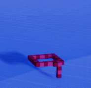

Stepped
- It's kind of like the opposite of easing, but here it is anyway
- Change EaseParam1 to set how many steps to use. It's set to 10 by default


Elastic
- Cartoony "boing" effect. May take parameter tweaking to get it just how you want it in your game. Use EaseParam1 and EaseParam2 to tweak the amplitude and period. Looks good with scale, or menus transitioning on screen.
- EaseParam1 (Amplitude) is set to 1.0 by default. Raise it to make it wobble farther, lower it to make it smaller. 
- EaseParam2 (Period) is set to 0.2 by default. Smaller is spazzier (more wave cycles in the same amount of time). Bigger means less cycles.


Bounce
- Bounces back from the target a couple of times

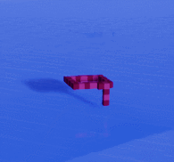

InBack
- Anticipation; pull back a little before going forward
- EaseParam1 (Overshoot) is set to 1.70158 by default. If you want to know why, here you go: https://github.com/Michaelangel007/easing#the-magic-of-170158


OutBack
- (insert low effort Australia joke here)
- It overshoots the target and then pulls back to meet it. You can tweak the overshoot amount with EaseParam1.

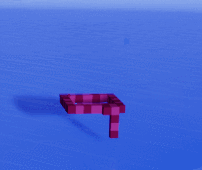

</details>

# Blueprints
<details>
<summary>Expand</summary>

## Basic Usage
Add a BP task from the "Tween" category.

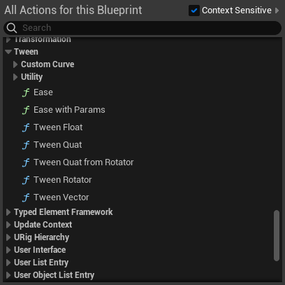

Give it a start and end value, and hook up the Apply Easing pin to your update logic. The Value pin gives you the current value each frame. Here is an example of how to move an actor up 50 units:


Which looks like this:

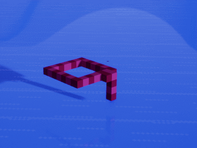

Here is one that does an infinite bobbing animation:

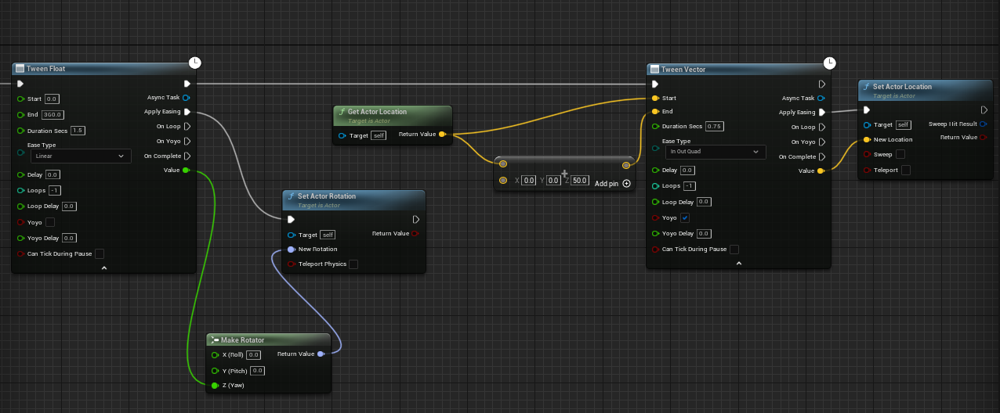

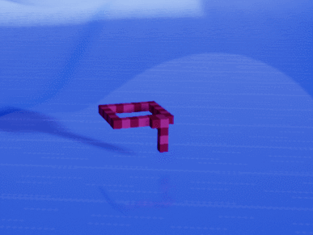

If you need to do something with the created tween later on, such as stopping it after an interaction, you can use the Async Task pin to operate on the tween.

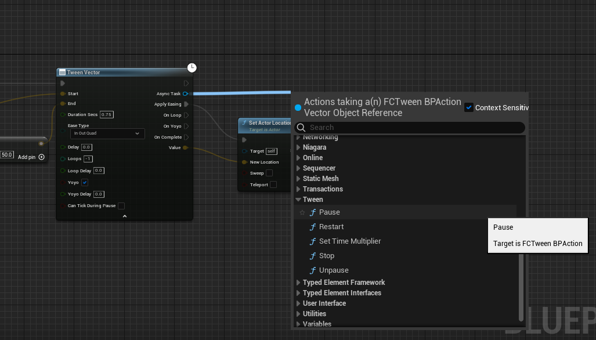

## Custom Curve

Use one of the versions under "Tweens/Custom Curve" to provide a UE curve as the easing function.


## Ease

Ease a 0-1 float with the given easing function. This is similar to UE's default Ease node, but it has all the FCTween functions available.

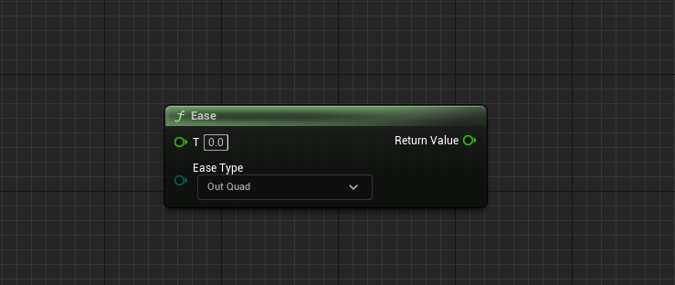

## Ease with Params

Same as ease, but you can override the baked in parameters for Elastic, Bounce, Back, and Smoothstep. 0 means no override provided. Default values are listed in the comments, if you hover over the param.

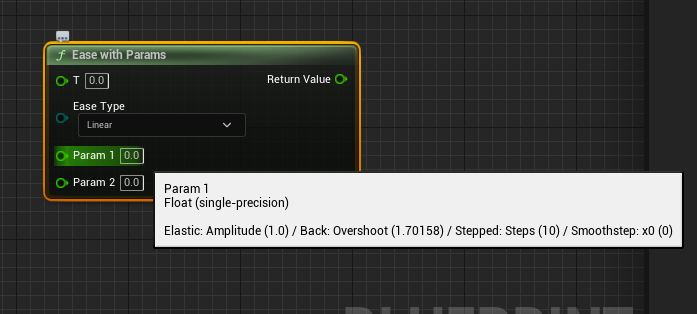

</details>

# C++

<details>
<summary>Expand</summary>

## Module Setup
- Copy the FCTween directory into your Source folder.

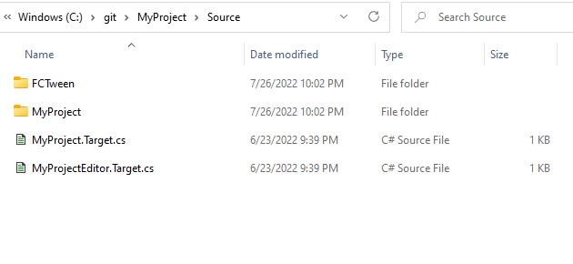

- Add FCTween to the module names in your main module's Build.cs:
```c#
PublicDependencyModuleNames.AddRange(new[] {"Core", "CoreUObject", "PhysicsCore", "Engine", "InputCore", "FCTween"});
```

- Add FCTween to your Modules list in your .uproject file
```json
"Modules": [
    {
        "Name": "MyProject",
        "Type": "Runtime",
        "LoadingPhase": "Default"
    },
    {
        "Name": "FCTween",
        "Type": "Runtime",
        "LoadingPhase": "Default"
    }
],
```

## Basic Usage

- You can tween Floats, Vectors, Vector2Ds, and Quaternions
- Pass a lambda expression to FCTween::Play() for the update functionality.

Basic example:
```c++
FCTween::Play(0, 1, [&](float t) { Foo = t; }, .5f);
```

With options:
```c++
FCTween::Play(0, 1, [&](float t) { Foo = t }, .5f, EFCEase::OutElastic)
    ->SetLoops(2)
    ->SetYoyo(true)
    ->SetOnLoop([&]() { /* on loop functionality */ });
```

## Using a custom curve

FCTween won't take in a UCurve (outside of Blueprints, which has helpers that do this same thing), but it's just two extra lines to do the lerp yourself:
```c++
UPROPERTY(EditAnywhere)
UCurveFloat* CustomCurve;

FVector Start = FVector::ZeroVector;
FVector End = FVector(0, 0, 150);

FCTween::Play(
    0, 1,
    [&](float t)
    {
        float EasedFloat = CustomCurve->GetFloatValue(t);
        FVector EasedVector = FMath::Lerp(Start, End, EasedFloat);
        SetActorLocation(OriginalPos + EasedVector);
    },
    10.0f, EFCEase::Linear);
```

## Setting start/end values during execution
Use the specific derived class to set `StartValue` or `EndValue` during execution.

```c++
FCTweenInstanceVector* Tween = nullptr;

virtual void BeginPlay() override
{
    Tween = FCTween::Play(
        Target1->GetActorLocation(), Target2->GetActorLocation(), [&](FVector t) { SetActorLocation(t); }, 10.0f);
    // the set functions return the base tween class, just be aware you'll have to static_cast it 
    // if you include it in the same line
    Tween->SetLoops(-1);
}
virtual void Tick(float DeltaSeconds) override
{
    Tween->StartValue = Target1->GetActorLocation();
    Tween->EndValue = Target2->GetActorLocation();
}
```

## Safety / avoiding errors

If your tween's update is calling code on an actor, and that actor gets destroyed, but the tween system is still running the tween, your update lambda will throw an error.

To avoid this, you could:

- **Manually keep track of the pointer and destroy it when you need to**
  - You will need to do this with some tweens anyway, if your game's logic needs to interrupt it, or if it's infinitely looping. Examples for that in the next section.

  
- **Call `FCTween::ClearActiveTweens()`**
  - This is useful for changing levels, if you know you want all tweens to stop executing.


- **Make the lamda itself safe**
  - This is useful for a non-looping tween that you just want to fire and forget, and there are some edge cases where the object is destroyed before it's finished - and you'd rather it just did its last few updates and cleaned itself up.
```c++
FCTween::Play(
    GetActorLocation(), GetActorLocation() + FVector(0, 0, 50),
    [&](FVector t)
    {
        if (IsValid(this))
        {
            SetActorLocation(t);
        }
    },
    2.0f);
```

- **Use UFCTweenUObject**
  - This is a simple UObject wrapper class. You can save this as a UPROPERTY and it will clean up the tween in BeginDestroy().
  - This is nice for something like an item pickup that has a looping tween animation you set up in code, and you want it to get auto-cleaned up when the pickup is destroyed instead of manually managing it.
```c++
UPROPERTY()
UFCTweenUObject* TweenObj;
	
TweenObj = FCTween::Play()
    ->CreateUObject();
```

- **Make a "safe mode" by modifying the library to add try/catch statements around lambda execution in FCTweenInstance, and enable exceptions in the build options**
  - I didn't add this option because it's a controversial move in the C++ world; and the moment I started thinking about how to add it, I sensed a great disturbance, as if millions of voices suddenly cried out in disgust. And, honestly, the other options seem like a better way to handle it.

## Tween Pointers

```c++
#pragma once

#include "FCTween.h"
#include "FCTweenInstance.h"

#include "TweenExample.generated.h"

UCLASS()
class ATweenExample : public AActor
{
	GENERATED_BODY()
	
public:
	UPROPERTY()
	int Foo = 0;

	FCTweenInstance* Tween = nullptr;

	virtual void BeginPlay() override
	{
		Super::BeginPlay();

		// tween a float from 0 to 1, over .5 seconds, infinitely looping
		Tween = FCTween::Play(0, 1, [&](float t) { Foo = t; }, .5f)
		    ->SetLoops(-1);
	}

	virtual void BeginDestroy() override
	{
		if (Tween != nullptr)
		{
			// tells FCTween to recycle this tween
			Tween->Destroy();
			Tween = nullptr;
		}

		Super::BeginDestroy();
	}
};
```
- If you keep a reference to an FCTweenInstance, do not mark it as UPROPERTY(), since it's not a UObject
  - When using the recompile button (live coding), be aware that making changes to a header with a non-uproperty field can bork your memory and cause an editor crash sometimes (usually in BeginDestroy), even if you're managing it properly in code. Close the editor and restart from your IDE when you want to be safe. Or make sure to save and commit your current changes to source control first.
  - If you want to avoid that, use UFCTweenUObject instead, since that IS a UObject, and its header won't be changing
- Tweens will get recycled when they are finished. If you keep a pointer to it after it's been completed, the tween will just be idle or playing a different set of options/callbacks from who knows where, so you will end up with confusing bugs if you try to operate on it. If you don't want them to get recycled:
  - set NumLoops to -1 (infinite) if you want it to infinitely replay, and you can pause/unpause it
  - OR if you need to be able to restart a tween later on, after it is finished, call `Tween->SetAutoDestroy(false)` to make sure it doesn't get auto-recycled. This is how UFCTweenUObject and the BP tasks make sure their tweens are always valid.
  - If you used one of the above cases, make sure to call Destroy on the tween when you are done with it, so that it gets recycled. Otherwise that memory will never get reclaimed.


## Manual Memory Management

If you have a case that the recycling system doesn't work for, or need to do something custom, you can manage the memory and the update manually.
  - The `new` operator is overloaded in UE ([ModuleBoilerplate.h](https://github.com/EpicGames/UnrealEngine/blob/release/Engine/Source/Runtime/Core/Public/Modules/Boilerplate/ModuleBoilerplate.h)) to use FMemory calls (which uses the mimalloc library on Windows), so it's safe to use new/delete in this way in the UE ecosystem.
```c++
#pragma once

#include "FCTween.h"
#include "FCTweenInstance.h"

#include "TweenExample.generated.h"

UCLASS()
class ATweenExample : public AActor
{
	GENERATED_BODY()

public:
	UPROPERTY()
	int Foo = 0;

	FCTweenInstanceVector* ManualTween = nullptr;

	virtual void BeginPlay() override
	{
		Super::BeginPlay();

		ManualTween = new FCTweenInstanceVector();
		ManualTween->Initialize( 
			FVector::ZeroVector, FVector::OneVector, [&](FVector t) { SetActorLocation(t); }, .5f, EFCEase::OutQuad);
		ManualTween->SetYoyo(true)
		    ->SetLoops(-1);
	}

	virtual void BeginDestroy() override
	{
		if (ManualTween != nullptr)
		{
			delete ManualTween;
			ManualTween = nullptr;
		}

		Super::BeginDestroy();
	}

	virtual void Tick(float DeltaSeconds) override
	{
		Super::Tick(DeltaSeconds);
		
		ManualTween->Update(DeltaSeconds, false);
	}
};
```

</details>

# References
<details>
<summary>Expand</summary>


- https://easings.net/
  - No code taken from this one, but the graphs are useful visual reference
- http://robertpenner.com/easing/
  - The original easing equations that everyone just riffs on nowadays
- https://github.com/Michaelangel007/easing
  - Much more useful versions of those easing equations
- https://github.com/photonstorm/phaser/tree/master/src/math/easing
  - Phaser has a surprisingly good tweening library, which I have utilized for Phaser-based web games before
- https://github.com/benui-dev/UE-BUITween
  - A couple of ideas taken from BenUI for setting up the module and naming

</details>

# License

MIT

The easing equations themselves are derivative of other people's work, and their licenses have been included in `FCEasing.h`